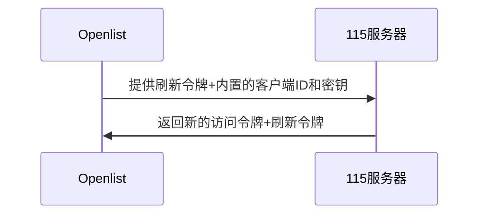
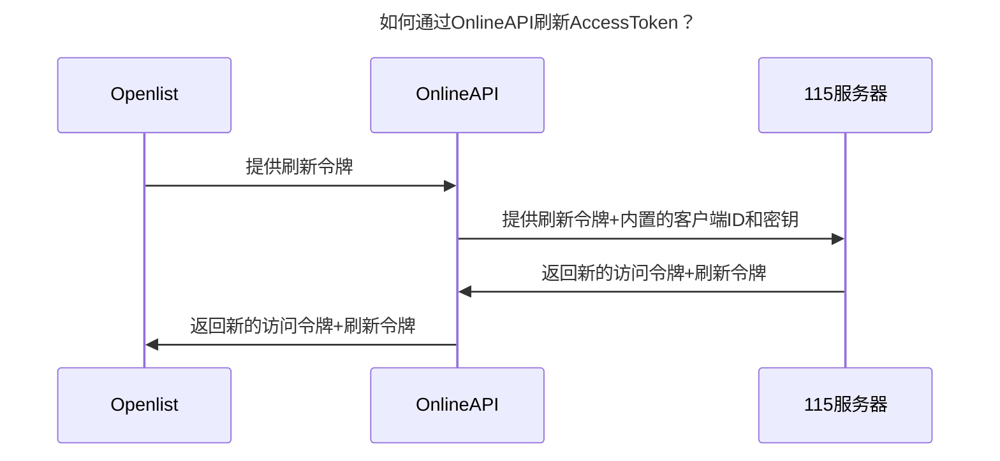
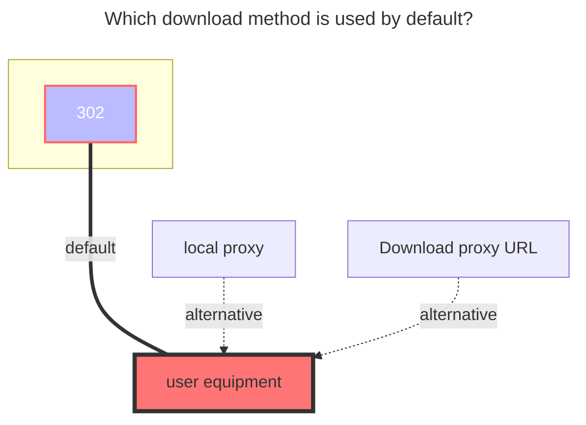

---
# This is the icon of the page
icon: iconfont icon-state
# This control sidebar order
order: 21
# A page can have multiple categories
category:
  - Guide
# A page can have multiple tags
tag:
  - Storage
  - Guide
  - "302"
  - Official
# this page is sticky in article list
sticky: true
# this page will appear in starred articles
star: true
headerDepth: 5
---

# 115 Open

::: tip

Developed with the official [**115 Open Platform API**](https://open.115.com)

:::

::: danger Please read the precautions carefully

Please use your account in a standardized manner. Do not use it for distribution services including but not limited to **`multi-person sharing`**, **`image hosting, software hosting`** and **`video external links to video websites for playback`**, as well as some other irregular uses not mentioned above. You will be responsible for the consequences of your account being blocked.

:::

<br/>

## 1. Necessary Conditions
An **115** account is required.
::: warning Note
The speed and stability are related to the local network environment, the network environment of the 115 server, and the performance of the machine running OpenList.
:::

## 2. Preparation for Access
### 2.1. Register an Application on the Open Platform (optional; no need to create if using the built-in key pair of OpenList/public welfare server/self-built server)
::: tip
Please register the application according to the requirements of the 115 Open Platform.
:::
Open Platform address: [115 Open Platform: https://open.115.com](https://open.115.com)

### 2.2. **Obtain Tokens**
1. Visit [api.oplist.org](https://api.oplist.org) **⚠️ If using a public welfare server/self-built server, visit the address of the public welfare server/self-built server**.
2. Select **115 Network Disk Verification** from the drop-down box.


3. If you are using the built-in key pair of `OpenList (or public welfare server/self-built server)` (i.e., you do not have application information from the 115 Open Platform), please configure according to `3.1`, `3.2`, and `3.3`:
   3.1. Check `Use parameters provided by OpenList`.
   3.2. Leave both `Client ID (ClientID/AppID)` and `Application Secret (AppKey/Secret)` blank.
   3.3. Click the `Get Token` button.


4. If you are using your own created OAuth client ID and secret, please configure according to `4.1`, `4.2`, and `4.3`:
   4.1. Do not check `Use parameters provided by OpenList`.
   4.2. Enter your `AppId` in `Client ID` and your `AppSecret` in `Application Secret`.
   4.3. Click the `Get Token` button.


5. In the pop-up window, log in to your 115 account and authorize OpenList to access your 115 network disk.


6. After successful authorization, the page will display your `Access Token` and `Refresh Token`. Please copy and save these two tokens.


## 3. Adding 115 Network Disk to OpenList
### 3.1. Configuration Instructions
#### 3.1.1. **Root Folder ID**
The default root directory ID is: `0`<br/>
Open the 115 network disk official website, and when clicking to enter the folder to be set, click the number after `cid` in the URL.<br/>
For example, <https://115.com/?cid=249163533602609229&offset=0&tab=&mode=wangpan><br/>
The `root folder ID` of this folder is `249163533602609229`.

### 3.2. Start Adding
1. Open the management interface of Alist and click `Storage` in the left menu.
2. On the storage list page, click the `Add Storage` button in the upper right corner.
3. Select the driver as `115 Open Platform`.


4. Enter the mounting path, such as: `115`.
5. Enter the root folder ID obtained above in `Root Folder ID` (please refer to [3.1.1. Root Folder ID](#_3-1-1-root-folder-id)).
6. Enter the obtained `Refresh Token` and `Access Token` in the refresh token (if not obtained, please refer to [2. Preparation for Access](#_2-preparation-for-access)).
7. If you are using the OAuth client ID and secret provided by `OpenList (or public welfare server/self-built server)`, please configure according to `7.1` and `7.2`:
   7.1. Check `Use online api` to indicate using the online API provided by OpenList.
   7.2. Fill in `https://api.oplist.org/115cloud/renewapi` as the Api url address. If it is a `public welfare server/self-built server`, please fill in the corresponding server address.


8. If you are using your own created OAuth client ID and secret, please configure according to `8.1` and `8.2`:
   8.1. Do not check `Use online api` to indicate using your self-built OAuth client ID and secret.
   8.2. Enter your `Oauth Client ID` in `Client ID` and your `Oauth Client Secret` in `Client Secret`.


9. Click the `Add` button to complete adding the 115 network disk.

## 4. Instructions on the `Use online api` Option
### 4.1. Method for Refreshing Access Token When Having Your Own Secret


### 4.2. Method for Refreshing Access Token When Not Having Your Own Secret


## 5. **Notes**

::: warning Handling Method for Token Leakage

If the Token is accidentally leaked, you can go to the 115 device login management to解除应用授权 (revoke application authorization).

- 115 APP: [iOS, Android] versions need to be ≥ 35.11.0
- 115 Web端: [https://115.com/?mode=device_manage](https://115.com/?mode=device_manage)

When it expires, the following content will be prompted:

```json
failed get objs: failed to list objs: code: 40140116, message: no auth
```

An account can obtain two `Refresh tokens` in the same application. After the third acquisition, the first obtained `Refresh token` will expire. Using the first `Refresh token` will prompt the above error.

:::

## 6. Using Other APP IDs to Obtain Refresh Tokens (Not Yet Implemented)

::: tip
Under development, the tutorial has not been updated yet. Stay tuned!
:::

## 7. Mobile QR Code Authorization PKCE Mode (Not Yet Implemented)
::: tip
Under development, the tutorial has not been updated yet. Stay tuned!
:::

## 8. Default Download Method Used

