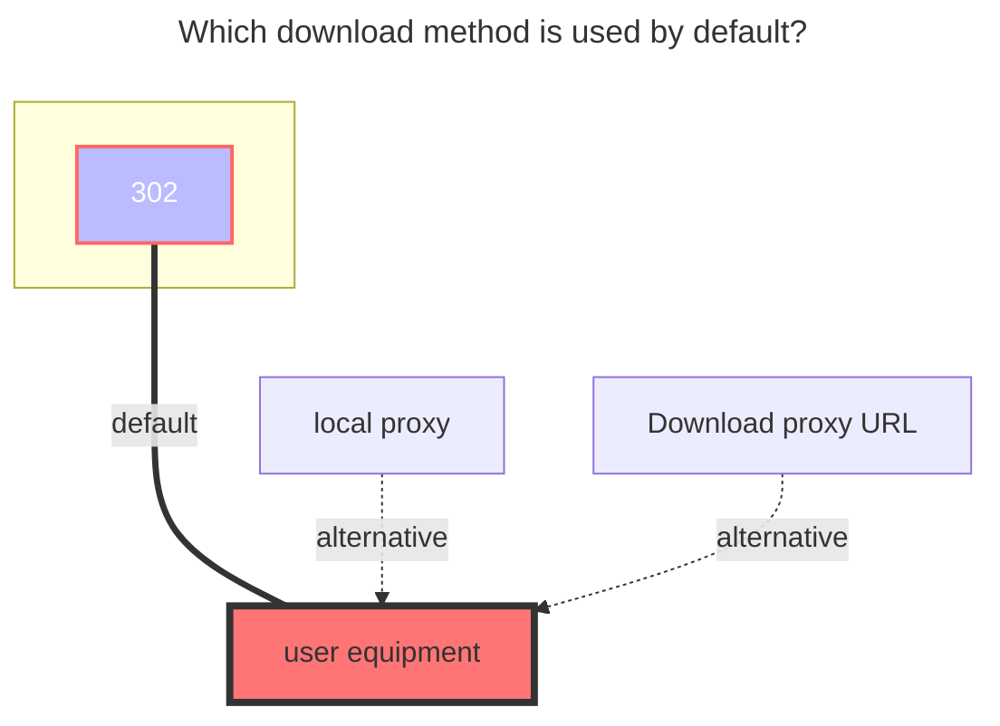

---
# This is the icon of the page
icon: iconfont icon-state
# This control sidebar order
order: 41
# A page can have multiple categories
category:
  - Guide
# A page can have multiple tags
tag:
  - Storage
  - Guide
  - "302"
# this page is sticky in article list
sticky: true
# this page will appear in starred articles
star: true
---

# 189Cloud

:::tip

The web -side login has been replaced with sliding verification code, **no longer supports OCR or manual input**. If the verification code needs to be used, please use the add `Cookie` to log in

This interface is a reverse-engineered interface and may become invalid at any time due to official risk control or blocking. Please follow relevant PRs for the latest updates.

:::

## **189CloudTV**

Uses the TV interface of Tianyi Cloud Drive, with the fewest mounting steps.

1. When mounting, select 189CloudTV. Leave the login parameters blank. If you are unsure, **just fill in the mount path**.

2. After clicking save, simply return to the storage management page. You can choose to log in by scanning a QR code or click the link to log in (for link login, if you are unsure, it is recommended to **right-click the link and open it in a new window**).

3. After entering, select SMS login. Once logged in, return to the storage management page. Disable and re-enable the storage to use it normally (you may need to refresh the page).

## **Personal Cloud**

### **username**
the phone number used to log in

### **password**

password for login

 

### **Root folder ID**

The string at the end of the official website url, such as:
- https://cloud.189.cn/web/main/file/folder/-11 -> `-11`
- https://cloud.189.cn/web/main/file/folder/71398114617385472 -> `71398114617385472`

 

### **Family transfer**

Give 189 cloud disk adds Personal's `Family Transfer option`, which is convenient for users without VIP, and a large number of family cloud spaces upload.

- Note: The old upload interface family cloud will still limit the upload quantity, so `Rapid upload` and ` Old Upload` will not take effect
- **https://github.com/alist-org/alist/pull/6288**

 

## **Family Cloud**

(Alone 189 CloudPC Plate Client Drive) Use a computer browser, open the developer tool (F12), switch the emulation device and select the mobile device

Open https://h5.cloud.189.cn/main.html#/family, enter the folder you want to mount, you can see the request in the network, and then find the required parameters:

 

### **OpenList fill in examples：**

#### **189 Cloud**

Fill in the account^1^and password^2^,Then click one request in the request, just bring `Cookies`, click on one at will Then fill in,Cookie expires time is unknown

#### **189 CloudPC**

Video reference: **https://www.bilibili.com/video/BV16A4y197De**

 

## **suggestion**

It is recommended to use the Tianyi cloud disk client first, [**Notes click to view.**](../../faq/howto.md#when-adding-tianyi-cloud-disk-client-storage-prompt-need-img-validate-code-verification-code)

 

### **The default download method used**

