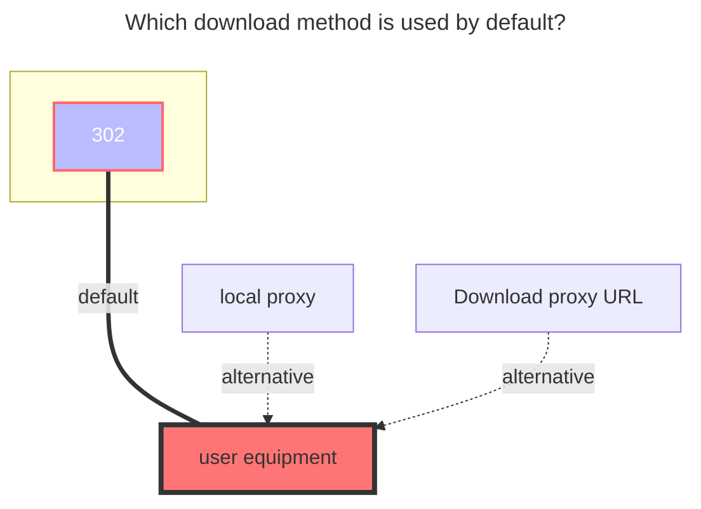

---
# This is the icon of the page
icon: iconfont icon-state
# This control sidebar order
order: 11
# A page can have multiple categories
category:
  - Guide
# A page can have multiple tags
tag:
  - Storage
  - Guide
  - "302"
  - Official
# this page is sticky in article list
sticky: true
# this page will appear in starred articles
star: true
---

# Aliyundrive Open

:::tip

Aliyundrive Open, developed based on the official authorization API.

:::

:::danger Read the precautions carefully

1. ==The refresh token obtained by this tool can only be used for **Aliyundrive open platform** storage mount method==

2. The token filled in when Alist is mounted should also be provided by this tool, and the previous acquisition method will not be available

3. Not applicable to others, but only for Alist

4. If the same IP requests =={{ max }}== times within =={{ minutes }}== minutes, **Too Many Requests** will appear. :no_entry_sign:So please do not abuse:no_entry_sign:
   - and viewing files and watching video downloads is not counted，The number of times and time mentioned above are dynamic~
   - New optimization: **will only refresh the token when the request finds that the token is expired, update restart editing if the token is still valid will not refresh.**

5. Online playback video reminder: **`ExceedCapacityForbidden`** error, the capacity exceeds restrictions, implements restrictions, needs to be expanded or deleted unnecessary file saving space to save space,[View details](#four、)

6. <i class="fa-solid fa-seal-exclamation fa-beat" style="color: #ff0000;"></i> **==Do not share the Alibaba cloud disk publicly, and the account is prohibited from being accessed by multiple IPs. If the account is frozen after sharing, you will be responsible for the consequences== <i class="fa-solid fa-seal-exclamation fa-beat" style="color: #ff0000;"></i>  After adding storage, please set up meta information and other measures in time to prevent the account from being frozen by {other people/crawlers} malicious [access/sharing]，Other cloud disks also need to be prevented from being frozen/banned**

7. It is prohibited to use Alibaba Cloud Disk to build distribution services including but not limited to **`picture bed, software bed`** and **`video external link to video website playback`**, as well as some non-standard usage methods not mentioned above. If you violate the rules and are `frozen/banned`, you will be responsible for the consequences and it cannot be lifted.
:::

### 1. Necessary Conditions  
A **AliyunDrive** account is required.  
::: warning Notes  
Speed and stability are related to the performance/network of the machine running OpenList and the load on the AliYun Drive server.  
:::  

### 2. Preparation for Access  
#### 2.1. Register an Application on the Open Platform (Optional; no need to create one if using the built-in key pair of OpenList/public welfare server/self-hosted server)  
::: tip  
Please register an application according to the requirements of the AliYun Drive Open Platform.  
:::  
Open Platform URL: [AliYun Drive Open Platform](https://www.alipan.com/developer/f)  

#### 2.2. **Obtain Tokens**  
1. Visit [api.oplist.org](https://api.oplist.org) **⚠️ If using a public welfare server/self-hosted server, visit the address of the public welfare server/self-hosted server.**  
2. Select **AliYun Drive App Login** from the drop-down menu.  

  
  

3. If you are using the built-in key pair of `OpenList (or public welfare server/self-hosted server)` (i.e., you do not have application information from the AliYun Drive Open Platform), configure according to `3.1`, `3.2`, and `3.3`:  
   3.1. Check `Use parameters provided by OpenList`.  
   3.2. Leave both `Client ID (ClientID/AppID)` and `App Secret (AppKey/Secret)` blank.  
   3.3. Click the `Get Token` button.  

  
  

4. If you are using your own created OAuth client ID and secret, configure according to `4.1`, `4.2`, and `4.3`:  
   4.1. Do not check `Use parameters provided by OpenList`.  
   4.2. Enter your `AppId` in `Client ID` and your `AppSecret` in `App Secret`.  
   4.3. Click the `Get Token` button.  

  
  

5. In the pop-up window, scan the code to log in to your AliYun Drive.  
  
6. After successful authorization, the page will display your `Access Token` and `Refresh Token`. Please copy and save these two tokens.  
  
  

### 3. Add AliYun Drive to OpenList  
#### 3.1. Start Adding  
1. Open the OpenList management interface and click `Storage` in the left menu.  
2. On the storage list page, click the `Add Storage` button in the upper right corner.  
3. Select the driver as `AliYun Drive (Oauth2)`.  
4. Enter the mount path, such as `aliyun-drive`.  
5. Enter the root folder ID obtained above in `Root Folder ID`. If using the root directory, enter `root`. See [Configuration Instructions/Root Folder ID](#_3-2-1-root-folder-id).  
  
  
5. Enter the refresh token obtained above in the refresh token field (if not obtained, refer to [Preparation for Access](#_2-preparation-for-access)).  
6. If you are using the OAuth client ID and secret provided by `OpenList (or public welfare server/self-hosted server)`, configure according to `6.1`, `6.2`, and `6.3`:  
   6.1. Check `Use online api`.  
   6.2. Leave both `Client ID (ClientID/AppID)` and `App Secret (AppKey/Secret)` blank.  
   6.3. Enter `https://api.oplist.org/alicloud/renewapi` in `Api url address`. If using a `public welfare server/self-hosted server`, enter the corresponding server address.  
  
  
7. If you are using your own created OAuth client ID and secret, configure according to `7.1`, `7.2`, and `7.3`:  
   7.1. Do not check `Use online api`.  
   7.2. Enter your `AppId` in `Client ID (ClientID/AppID)` and your `AppSecret` in `App Secret (AppKey/Secret)`. See [Configuration Instructions/Client ID, Secret](#_3-2-2-client-id-secret).  
   7.3. Leave `Api url address` blank.  
  
  
8. In the `Instant Upload` option, select whether to enable the instant upload function (optional). See [Configuration Instructions/Instant Upload](#_3-2-3-instant-upload).  
9. In `Removal Method`, select the way to delete files (optional), default is recycle bin. See [Configuration Instructions/Removal Method](#_3-2-4-removal-method).  
10. In `Cloud Drive Type`, select the cloud drive type (optional), default is `Default`. See [Configuration Instructions/Cloud Drive Type](#_3-2-5-cloud-drive-type).  
11. In `Livp Download Format`, select the format for downloading live photos (optional), default is `Jpeg`. See [Configuration Instructions/Livp Download Format](#_3-2-6-livp-download-format).  
12. In `Internal Upload`, select whether to enable internal upload (optional), default is off. See [Configuration Instructions/Internal Upload](#_3-2-7-internal-upload).  
13. Click the `Add` button to complete adding AliYun Drive.  

#### 3.2. Configuration Instructions  
##### 3.2.1. **Root Folder ID**  
The default is `root`, displaying all cloud drive contents. If you only want to display contents within a certain folder, change it to `file_id`.  

Open the AliYun Drive official website, and when clicking into the folder to be set, click the string after the URL.  
For example, https://www.alipan.com/drive/folder/5fe01e1830601baf774e4827a9fb8fb2b5bf7940  
The file_id of this folder is `5fe01e1830601baf774e4827a9fb8fb2b5bf7940`.  
  

##### 3.2.2. **Client ID, Secret**  
Normal users can leave it blank. If you have applied for official authorization, you can fill in your own. When blank, it defaults to using those provided by OpenList.  
- If using your own developer account, the Oauth token link must also be modified, and you must use your own developer account ID and secret to obtain the refresh token.  

##### 3.2.3. **Instant Upload**  
- **Version v.3.22.1** new feature.  
Instant upload requires enabling `Instant Upload` when mounting. The prerequisite for instant upload is that the file already exists in AliYun Drive; otherwise, it will be a normal upload.  
Instant upload calculates the file's `sha1` value (should be correct) without requiring you to calculate it. You just need to upload, and it will automatically calculate after upload completion.  
- It uses the interface provided by AliYun Drive's official API. For details, see :point_right: [**Instant Upload Logic**](https://www.yuque.com/aliyundrive/zpfszx/ezlzok#y7lyH).  

-----  
- **Version v.3.27.0** enhances instant upload: files can be instantly transferred between `115 Network Disk` and AliYun Drive by direct copying.  
  - Prerequisite: To instantly transfer a file from AliYun Drive to 115, the file must already exist in 115; otherwise, it will be a normal copy task.  
  - If instantly transferring a file from 115 to AliYun Drive, enable the instant upload option for AliYun Drive; otherwise, it will be a normal upload.  

It is recommended to locally deploy an OpenList on your home computer, add a `local storage` and `AliYun Drive`, and use copy instant upload to save resources.  

##### 3.2.4. **Removal Method**  
If not set, it defaults to deleting to the recycle bin. If space is insufficient, you need to manually clean the recycle bin. If a file is deleted by mistake, please go to the AliYun Drive official website client to retrieve it.  
- **Recycle Bin**: Deleting in OpenList will move the file to the network disk recycle bin, occupying cloud drive space, but it can be retrieved later if deleted by mistake.  
- **Delete**: Direct deletion without staying in the recycle bin, not occupying cloud drive space, but cannot be retrieved later if deleted by mistake.  
  - Note: Do not leak the Token obtained from AliYun Drive Open. If leaked by mistake, please immediately:  
  - **Open AliYun Drive app → My → Settings gear icon in the upper right corner → Privacy Settings → Authorization Management → Click OpenList to view and revoke authorization**.  
  - Then rescan the code to authorize for a new refresh token. Revoking authorization will invalidate all previously obtained tokens to protect your account security.  

##### 3.2.5. **Cloud Drive Type**  
You can select the cloud drive type according to your needs. When adding a driver using OpenList version v3.25.1 and above, the default selection is `Default`.  
- **Default**: For users with a talent level, it defaults to displaying `non-backup file` content; for users without a talent level, it defaults to displaying `backup file` content.  
- **Resource Library**: Corresponding to the `non-backup file content` of the cloud drive.  
- **Backup Disk**: Corresponding to the `backup files` of the cloud drive.  

After AliYun Drive updated to version `6.0` in July 2024, the backup disk was changed to merge backup files and all files, but in terms of OpenAPI, it still distinguishes between `Resource Library` and `Backup Disk` types.  
  

##### 3.2.6. **Livp Download Format**  
That is, iOS `live` photos cannot be parsed by non-iOS systems, so they cannot be downloaded. Now, you can choose `Jpeg` or `Mov` according to your needs.  
- Jpeg: The cover of the `live` photo.  
- Mov: The video frame of the `live` photo when long-pressed.  

##### 3.2.7. **Internal Upload**  
If the server where OpenList is deployed is an AliYun ECS in the Beijing region, turning on this switch can improve file upload speed. Do not turn on this switch for servers that do not meet the requirements, otherwise, upload failures will occur.  
- Can `Internal Upload` be used on non-Beijing AliYun ECS? No, because AliYun Drive uses object storage in the Beijing region.  

### 4. Other Instructions  
#### 4.1. Permission Scope  
> OpenList only obtains cloud drive user (**name, avatar ¹**), (**file access permission ²**), and (**file write permission ³**), without obtaining phone number permission.  
> Details can be viewed in the following two ways:  
> 1. The **prompt** when scanning the code to obtain the refresh token.  
> 2. Open **AliYun Drive app → My → Settings gear icon in the upper right corner → Privacy Settings → Authorization Management → Click OpenList** to view.  
>    - You can manually revoke permissions at any time if not in use.  

#### 4.2. About Video Playback  
> The default player is AliYun Drive's built-in player - **Aliyun Video Previewer**.  
> Videos uploaded to the cloud drive will be transcoded into H.264-encoded video streams through the transcoding service. (The benefit is that iOS can play them... Well, it should be like this.)  
> - For newly uploaded videos, only the first 30s of the video is pre-transcoded by default. The first play will trigger full video transcoding. The transcoded video will be cached, and no retranscoding is needed for subsequent plays.  
> - Videos shorter than 30s will not trigger pre-transcoding, and transcoding will only start when played for the first time.  
> - Real-time transcoding takes some time.  
> - Video qualities are: LD|SD|HD|FHD|QHD.  

#### 4.3. Inability to View Office Suite Files  
> Q: Why can't Office suite files be viewed in AliYun Drive Open?  
> A: ~~Because AliYun Drive has not opened the relevant API, so it cannot be viewed temporarily~~ (Stay tuned.)  

#### 4.4. Subtitle Loading  
> Q: How to load subtitles?  
> A: AliYun Drive Open needs to use the **Aliyun Video Previewer** player, and currently only supports transcoding srt and vtt text format subtitles encapsulated in mkv.  
> - Currently, only three languages are supported: eng, jpn, chi. Other languages will be lost.  

#### 4.5. Common Issues  
1. **ExceedCapacityForbidden**  
> Q: When playing AliYun Drive videos online, it cannot play and prompts the error: **`ExceedCapacityForbidden`**.  
> A: **The user's capacity is exceeded**, restricting playback. You need to expand the capacity or delete unnecessary files to free up space
> - In OpenList, it prompts: `ExceedCapacity Forbidden: Execeed Capactity Forbidden`.
> - In AliYun Drive, it prompts: `云盘可用空间不足` (Insufficient available space in cloud drive).

2. Transcoding in progress, please try again later.  
> Q: When viewing a video in AliYun Drive, it prompts `Transcoding in progress, please try again later`, and when mounting in OpenList, it prompts: `failed link: failed get link: UserNotAllowedAccessResource: user not allowed access resource for violation`.  
> A: It means the account has been frozen (previously, it was directly unable to log in). For specific situations, please check the red content notes at the top.

## 5.**The default download method used**

