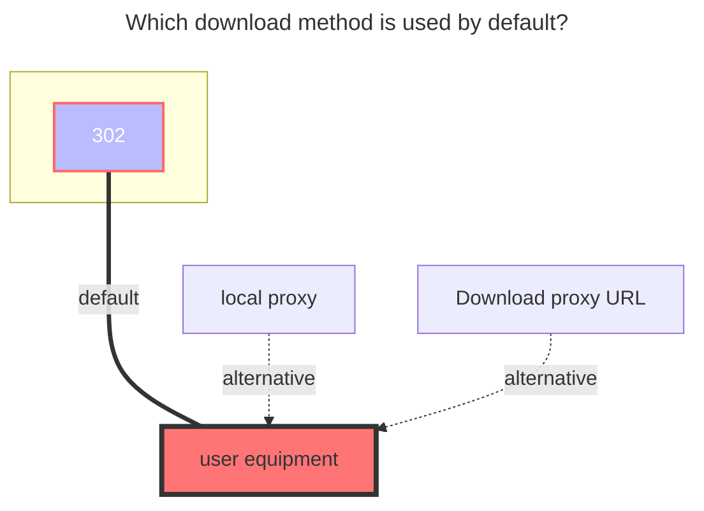

---
# This is the icon of the page
icon: iconfont icon-state
# This control sidebar order
order: 241
# A page can have multiple categories
category:
  - Guide
# A page can have multiple tags
tag:
  - Storage
  - Guide
  - "302"
# this page is sticky in article list
sticky: true
# this page will appear in starred articles
star: true
---

# Dropbox

Dropbox Official：https://www.dropbox.com/


## **Get refresh token**
- **This cloud drive does not support the online API mode provided by OpenList.**  
  - The following tutorial applies when the option is kept disabled as shown below.  
  
  - The steps are as follows:
  - If you create your own `Client ID` and `Secret`, remember to authorize them.
  - First, [click here](https://www.dropbox.com/developers/apps?_tk=pilot_lp&_ad=topbar4&_camp=myapps) to enter the Dropbox app management page and click "Create App".
  
  - After entering the app, configure the app type as shown below.
  
  - You can get the id and secret in the red box: the upper one is the id, the lower one is the secret.
  
  - Configure the callback URL. If you are strict about permissions and do not want to use an external callback address, you can set a local address here, or use the one outside the red box.
  
  - Finally, go to the permissions configuration page to set the app's permissions.
  
  - [Click here](https://api.oplist.org/) to enter the token acquisition tool. Select Dropbox, fill in your id and secret, and after authorization you can get the refresh token.
  - In the Openlist configuration page, enter the refresh token, id, and secret to use. Note that the refresh token is about 40-50 characters long.
  
  - If you are highly privacy-conscious, Dropbox supports local callback. You can use the following script provided by GPT to quickly implement it, communicating only with Dropbox servers.
  - **Note: Since the callback address is local and you have not set up a real local callback server, please manually copy the authorization code from the browser address bar.**
  - **Please resolve Python environment issues yourself, or use the callback server provided above.**
  ```python
  import requests
  import webbrowser

  # Please replace with your own Dropbox App information
  CLIENT_ID = 'your_app_key'
  CLIENT_SECRET = 'your_app_secret'
  REDIRECT_URI = 'http://localhost:114514'

  # Step 1: Get authorization code
  auth_url = (
    f"https://www.dropbox.com/oauth2/authorize"
    f"?client_id={CLIENT_ID}"
    f"&redirect_uri={REDIRECT_URI}"
    f"&response_type=code"
    f"&token_access_type=offline"  # Required: key parameter to get refresh_token
  )

  print("👉 Please visit the following link to authorize:\n")
  print(auth_url)
  webbrowser.open(auth_url)

  auth_code = input("\n✅ After authorization, paste the code after ?code= in the redirected URL here:\n> ").strip()

  # Step 2: Exchange for access_token + refresh_token
  token_url = "https://api.dropboxapi.com/oauth2/token"
  data = {
    'code': auth_code,
    'grant_type': 'authorization_code',
    'client_id': CLIENT_ID,
    'client_secret': CLIENT_SECRET,
    'redirect_uri': REDIRECT_URI
  }

  response = requests.post(token_url, data=data)
  response.raise_for_status()

  tokens = response.json()

  # ✅ Only output the refresh token
  print("\n🎉 Success! Your Dropbox refresh_token is:\n")
  print(tokens.get("refresh_token"))
  ```

## **Root folder file_id**

**Empty is the root directory**：display all files

**Single folder ID**：Enter the folder you need to display, copy the top link to fill in `/home` behind


### **The default download method used**


