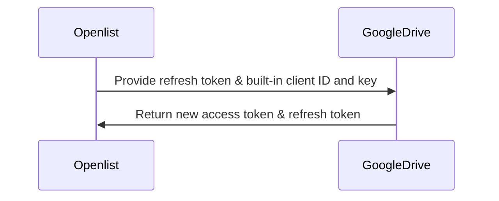
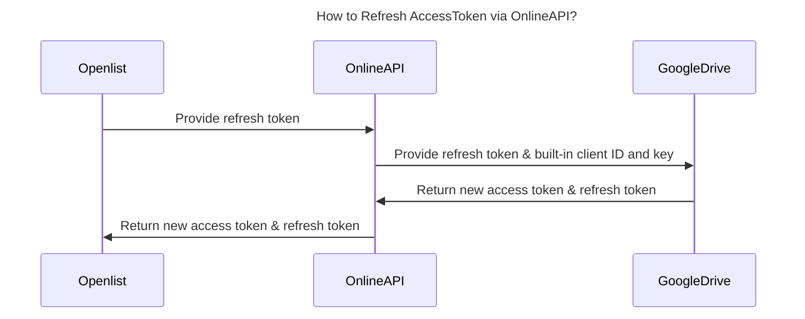
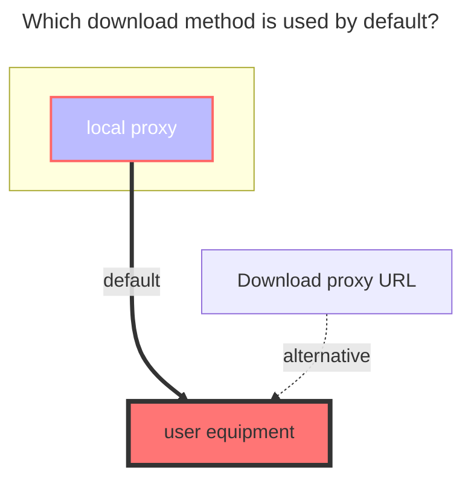

---
# This is the icon of the page
icon: iconfont icon-state
# This control sidebar order
order: 111
# A page can have multiple categories
category:
  - Guide
# A page can have multiple tags
tag:
  - Storage
  - Guide
  - "Native Rroxy"
  - Official
# this page is sticky in article list
sticky: true
# this page will appear in starred articles
star: true
---

# Google Drive  
Supports team drives (fill in the directory ID of the team drive for the root directory ID)  

## 1. Necessary Conditions  
::: warning Notes  
1. The machine where the OpenList service is deployed must first be able to connect to Google Drive.  
2. The Google Drive API service must be activated. For the activation method, see [Enabling the Google Drive API](#_2-1-enabling-the-google-drive-api).  
> Refer to [Google Workspace > Google Drive > Guide](https://developers.google.com/workspace/drive/api/quickstart/js): https://developers.google.com/workspace/drive/api/quickstart/js  
:::  

## 2. Preparation for Integration  

### 2.1. Enabling the Google Drive API  
1. On the [guide page](https://developers.google.com/workspace/drive/api/quickstart/js), find the `Enable API` button, click to enter the quick activation interface, click Next and Confirm to complete the activation.  
2. You can also visit the [Google Drive API management interface](https://console.cloud.google.com/apis/library/drive.googleapis.com), find the `Enable` button at the top, click and wait for the activation to complete.  
3. `Quota and System Limit Management` (optional): Switch to the `Quota and System Limits` tab, and set appropriate quotas and limits according to your usage and needs.  

### 2.2. Creating an OAuth Client (optional; no need to create if using OpenList/Community server/self-hosted server)  
1. In the [Credentials interface](https://console.cloud.google.com/apis/credentials?hl=zh-cn), click the `Create Credentials` drop-down menu, and select and click `OAuth Client ID`.  

  

2. In the pop-up window, select `Web Application` and fill in the application name.  
3. In the `Authorized Redirect URIs`, enter `https://api.oplist.org/googleui/callback`. If using a self-hosted or Community server, enter the corresponding domain name, such as `https://your-domain.com/googleui/callback`.  
4. Click the `Create` button to complete the creation of the OAuth client. Note: Please copy and save the `Client ID` and `Client Secret` for subsequent use.  

  

5. Add yourself as a test user. Find the `Target` menu on the left, click to enter, find the `+ Add User` button under `Test Users`, click and enter your Google account email address, then click Add.  

  

6. After testing, you can publish the application. Find the `Target` menu on the left, click to enter, find the `Publish App` button under `Publishing Status`, click and confirm to complete the app publishing.  

  

### 2.3. Obtaining `Access Token` and `Refresh Token`  
1. Open the [OpenList Google Authorization Page](https://api.oplist.org/) **⚠️ If using a Community server/self-hosted server, visit the Community server/self-hosted server**.  
2. In the drop-down box on the page, select `Google Drive Team`.  

  

3. If you created an OAuth client ID in the above steps, enter the created `Client ID` and `Client Secret` in the following input boxes.  

  

Otherwise, check ☑️ to use the API provided by OpenList. **⚠️ If using a Community server/self-hosted server, the built-in client ID and application secret of the Community server/self-hosted server are used at this time**.  

  

4. Click the `Get Authorization` button, the system will jump to the Google authorization page, log in to your Google account, and authorize OpenList to access your Google Drive.  

  

5. If the prompt `This app isn't verified by Google` appears, click `Advanced`, then click `Go to oplist.org (unsafe)` to continue. (If it is a Community server/self-hosted server, the domain name here is based on the actual Community service domain name, please carefully identify).  

  

6. Please pay attention to the permission information on the authorization page (in the red box below), ensure that it only accesses your **Google Drive files**. If you find that the permission in the Community service is not limited to accessing **Google Drive**, please raise an issue in [openlistteam/docs/issues](https://github.com/openlistteam/docs/issues).  

  

6. After successful authorization, the system will return a `Refresh Token` and `Access Token`. Please copy and save the token for use in subsequent configurations.  

  

## 3. Adding Google Drive to Alist  

### 3.1. Configuration Instructions  
#### 3.1.1. **Root Folder ID**  
Similar to Alibaba Cloud Drive, it is the last string in the official website URL, such as:  

  

### 3.2. Starting to Add  
1. Open the Alist management interface and click the `Storage` menu on the left.  
2. On the storage list page, click the `Add Storage` button in the upper right corner.  
3. Select the driver as `Google Drive`.  

  

4. Enter the mount path, such as: `google-drive`.  
5. Enter the root folder ID obtained above in the `Root Folder ID`. If using the root directory, enter `root`.  
6. Enter the refresh token obtained above in the refresh token (if not obtained, please refer to [Preparation for Integration](#_2-preparation-for-integration) ).  
7. If you are using the OAuth client ID and secret provided by `OpenList (or Community server/self-hosted server)`, configure according to `7.1` and `7.2`:  
   7.1. Check `Use online api` to indicate using the online API provided by OpenList.  
   7.2. Fill in the Api url address as `https://api.oplist.org/googleui/renewapi`. If it is a `Community server/self-hosted server`, enter the corresponding server address.  

 

8. If you are using your own created OAuth client ID and secret, configure according to `8.1` and `8.2`:  
   8.1. Do not check `Use online api` to indicate using your own built OAuth client ID and secret.  
   8.2. Enter your `Oauth Client ID` in `Client ID` and your `Oauth Client Secret` in `Client Secret`.  
   
 

9. Click the `Add` button to complete the addition of Google Drive.

## 4. Instructions on the "Use online api" Option  
### 4.1. AccessToken Refresh Process When Having Your Own Key  

### 4.2. AccessToken Refresh Process When Not Having Your Own Key  

## 5. Which Download Method Is Used by Default?  

