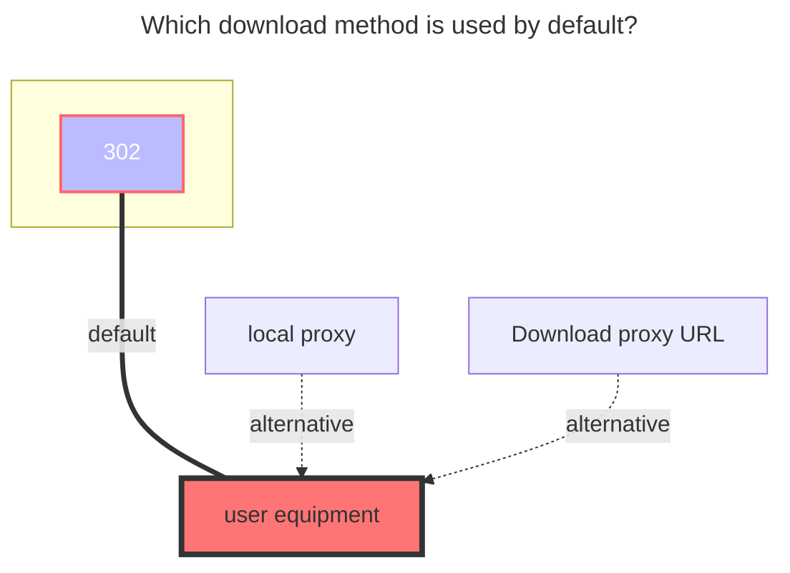
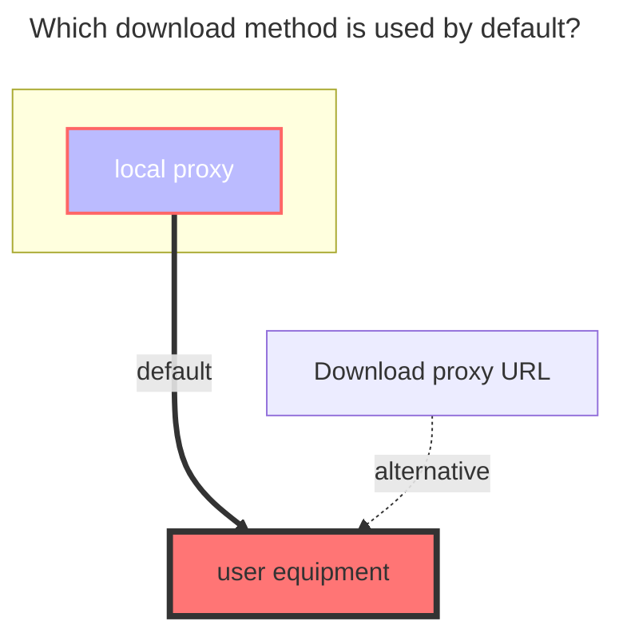

---
# This is the icon of the page
icon: iconfont icon-state
# This control sidebar order
order: 171
# A page can have multiple categories
category:
  - Guide
# A page can have multiple tags
tag:
  - Storage
  - Guide
  - "Native Rroxy"
  - "302"
# this page is sticky in article list
sticky: true
# this page will appear in starred articles
star: true
---

# Quark / TV / Open

**https://pan.quark.cn**

::::danger
Due to the speed limit of Quark Cloud,Quick Cloud must use local agents for transmission now,[For details, see](https://github.com/alist-org/alist/issues/4318#issuecomment-1536214188)

::: tip

**V4.0.7 version has added open 302 redirection**

:::

::::

## **Quark Cloud**

### **Cookie**

Press F12 to open "Debug", select "Network", select any request on the left, and find the one with the `Cookie` parameter.

 

### **Use transcoding address**

:::tip

When the LAN environment/server uplink bandwidth is sufficient, it is not recommended to enable the `Use transcoding address` option.

:::

After opening, the video file address will be obtained through the `Use transcoding address`, with the highest support for `4K` image quality, the link **supports 302 redirection **, and the video source network disk transcoding compressed image quality

- Note: After opening, **get the transcoding video file, and its file size is different from the original video file size**, because the network disk service provider has transcoding and compression
- It is recommended to match
- - `Web Proxy`: option is off
- - `WebDAV Policy`: Use the `302 Redirect` option
- - `Use transcoding address` : option is enabled

 

### **Only list video file**

After opening, only folders and video files are displayed. It is recommended to use them in conjunction with the above `Use transcoding address`

 

### **Root Folder ID**

Root Folder ID is `0`

- After entering the folder, get the directory ID in the top address bar. If the subdirectory is deeper, the directory ID will be at the back of the address bar. Just write the subdirectory ID you want to mount.

Note that only Cookies captured in Chrome is available, use Firefox's Cookies may remain in guest and still require login.

 

### **The default download method used**

illustrate：[**alist/issues/4318**](https://github.com/alist-org/alist/issues/4318#issuecomment-1536214188)

## **Quark TV**

The TV version supports `302`, but only `List` and `Download` operations are supported. Other operations are not supported (the interface does not support it).

 

### **Add method**

1. Select the `QuarkTV` driver, fill in the mounting path, and then save

2. Return to the all driver page and use the mobile APP to scan the QR code (If the QR code is not displayed, click on `Table Layout` in the upper right corner of the driver to switch from list mode to table mode)

3. After scanning the QR code to confirm, disable the driver, then enable the `driver` to use it.
   - `Refresh token`、`Device id `、`Query token`, It will be filled in automatically, no manual filling is required
     - Please do not edit manually and modify it

 

### **Root Folder ID**

Root Folder ID is `0`

- After entering the folder, get the directory ID in the top address bar. If the subdirectory is deeper, the directory ID will be at the back of the address bar. Just write the subdirectory ID you want to mount.

 

### **The default download method used**

 

## **Quark Open**

### AppID、SignKey

- **https://api.oplist.org** Authorization page selection **夸克网盘 (OAuth2) Verify login**

  - **AppId**，**SignKey**，It is not convenient to provide it directly, `find a way to get it yourself`:crying_cat_face:

 

### **Use online api**

Token refresh Use the online interface in the `Api url address` to refresh the token. Due to the lack of relevant documents, local refresh has not been implemented at present. You can only use **Use online api** to refresh the token.

 

### **The default download method used**

