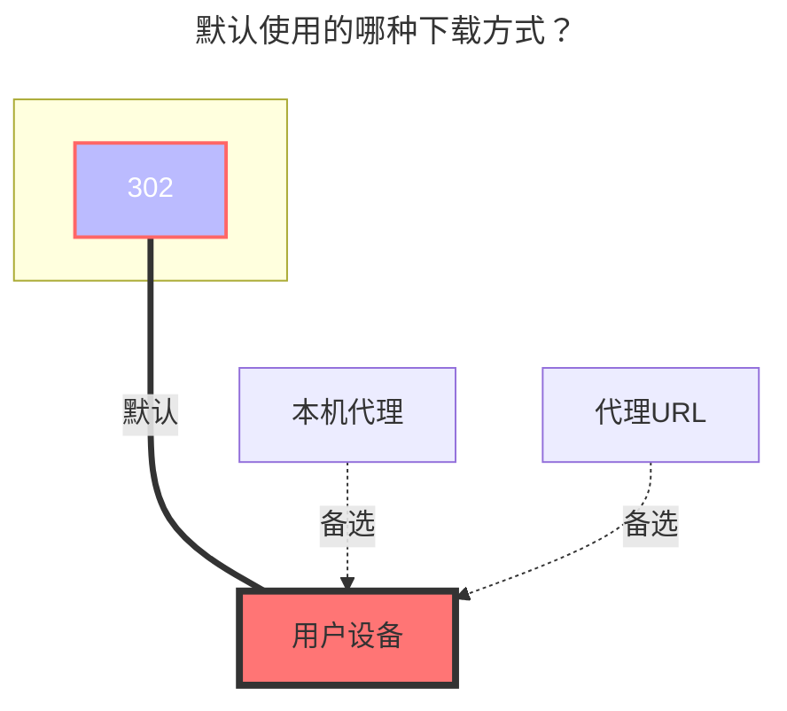
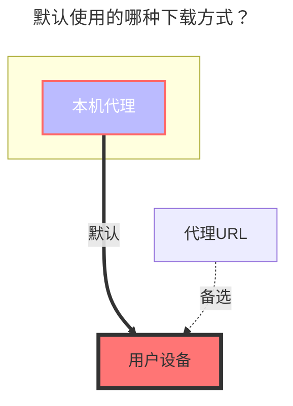

---
# This is the icon of the page
icon: iconfont icon-state
# This control sidebar order
order: 171
# A page can have multiple categories
category:
  - Guide
# A page can have multiple tags
tag:
  - Storage
  - Guide
  - "本地代理"
  - "302"
# this page is sticky in article list
sticky: true
# this page will appear in starred articles
star: true
---

::: danger 请仔细阅读注意事项

本接口是基于历史产物的逆向接口，项目组不会主动进行维护，请勿针对此驱动提出有关于任何修复或进行进一步逆向行为需求的issue。

:::

# 夸克网盘 / TV / Open

**https://pan.quark.cn**

::::danger
由于夸克网盘限速问题，夸克网盘现在只能使用本地代理进行传输，[说明详见](https://github.com/alist-org/alist/issues/4318#issuecomment-1536214188)

::: tip

**V4.0.7 版本新增开放302模式**

:::

::::

## **夸克网盘**

### **Cookie**

按F12打开“调试”，选中“网络”，随意在左侧选择请求，找到携带 `Cookie` 参数的就可以

 

### **视频转码地址**

:::tip

局域网环境/服务器上行带宽足够的情况下，不建议开启 `视频转码地址 - UseTransCodingAddress` 选项

:::

开启后，视频文件地址将通过 `转码接口获取` ，最高支持`4K`画质，链接**支持302重定向**，视频来源网盘转码压缩后的画质

- 注意 开启后 **获取的是转码后的视频文件**，**其文件大小与原视频文件大小不相同**，因为网盘服务商进行了转码压缩
- 建议搭配
- - `Web 代理`: 选项关闭
- - `WebDAV 策略`: 使用 `302 重定向` 选项
- - `视频转码地址`: 选项开启

 

### **仅展示视频文件**

开启后只展示文件夹和视频文件，建议配合上面的 `视频转码地址` 使用

 

### **根文件夹ID**

根目录ID为 `0`

- 子文件夹ID进入文件夹后顶部地址栏获取目录ID，如果子目录越深目录ID在地址栏越靠后，想挂载哪个子目录就写那个子目录ID就可以

注意：请使用Chrome浏览器来获取Cookies，使用Firefox获取的Cookies或仍将停留在访客并请求登录。

 

### **[在线预览/下载]很慢?**

夸克云盘下载很慢是因为夸克云盘需要开通**会员**，并且挂载只能^(强制)^使用`本地代理`方式，就需要你搭建OpenList的机器有一个很高的带宽速度

- 什么是`本地代理`？

  - `本地代理`就是你搭建OpenList的机器来中转,就是先下载到你搭建OpenList的机器，再由机器转发给你，你搭建OpenList的机器速度不够快，再转发给你的速度自然也不够快
1. 换带宽高的服务器来中转
   
2. 在自己家里电脑搭建
   
3. 直接放弃不用.

 

### **默认使用的下载方式**

说明：[**alist/issues/4318**](https://github.com/alist-org/alist/issues/4318#issuecomment-1536214188)

 

## **夸克TV**

TV 版支持 `302`，但是只能 `访问` 和 `下载` 两个操作，其它操作不支持(接口不支持)

 

### **添加方式**

1. 选择 `夸克TV / QuarkTV` 驱动，填写挂载路径，然后保存
2. 返回全部驱动页面，使用手机APP扫描二维码（如果不显示二维码，驱动右上角点击点击`表格布局` 从列表模式切换成表格模式）
3. 扫码确认后，禁用驱动，再启用`驱动`即可使用
   - `Refresh token 刷新令牌`、`Device id 设备ID `、`Query token` 会自动填充，不需要人工填写
     - 请不要进行编辑手动修改

 

### **根文件夹ID**

根目录ID为 `0`

- 子文件夹ID进入文件夹后顶部地址栏获取目录ID，如果子目录越深目录ID在地址栏越靠后，想挂载哪个子目录就写那个子目录ID就可以

 

### **默认使用的下载方式**

 

## **夸克Open**

### AppID、SignKey

- **https://api.oplist.org** 授权页面选择 **夸克网盘 (OAuth2) 验证登录**

  - **AppId**，**SignKey**，不方便直接提供，`自己想办法获取` :crying_cat_face:

 

### **使用在线api**

令牌刷新 使用 `Api url 地址` 中的 在线接口进行令牌刷新操作，因缺少相关文档，目前未实现本地刷新，只能使用在线接口进行刷新令牌

 

### **默认使用的下载方式**

